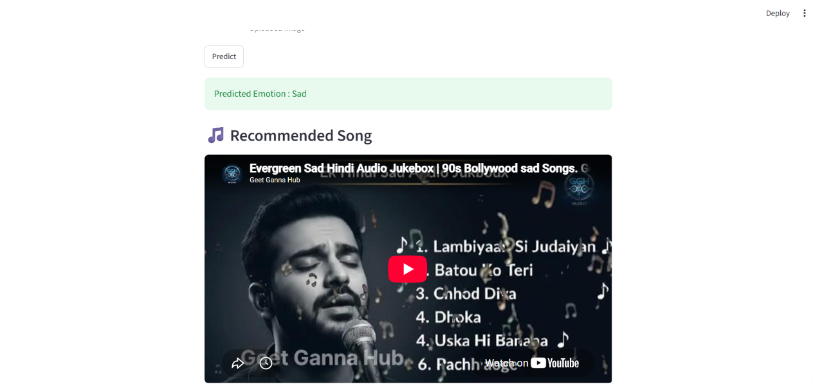

# 😊 Emotion Detection and Music Recommendation System

A deep learning web application built with **PyTorch** and **Streamlit** that detects human emotions from facial images using a Convolutional Neural Network (CNN) and recommends YouTube music based on the predicted emotion.

---

## 🚀 Features

- Detects **7 human emotions** from facial images
- Upload images through a **Streamlit** web interface
- CNN model built using **PyTorch**
- Recommends YouTube songs based on the detected emotion
- Fast and simple user interface
- Trained on the **FER2013** dataset

---

## 🖼️ Supported Emotions

- 😠 Angry
- 🤢 Disgust
- 😨 Fear
- 😊 Happy
- 😐 Neutral
- 😢 Sad
- 😲 Surprise

---

## 🛠️ Tech Stack

- Python
- PyTorch
- Torchvision
- Streamlit
- Pillow (PIL)
- Requests
- Regular Expressions (re)

---

## 🧠 Model Architecture

The CNN consists of:

- 3 Convolutional Layers
- Batch Normalization
- ReLU Activation
- Max Pooling
- Fully Connected Layers
- Softmax Classification (7 Classes)

---

## 📊 Model Performance

| Metric | Value |
|---------|-------|
| Dataset | FER2013 |
| Validation Accuracy | **58.67%** |
| Number of Classes | 7 |
| Epochs | 10 |

---

## 🎵 Music Recommendation

After predicting the user's emotion, the application recommends a relevant Bollywood YouTube song.

Examples:

| Emotion | Recommendation |
|---------|----------------|
| Happy | Happy Hindi Songs |
| Sad | Sad Hindi Songs |
| Angry | Energetic Songs |
| Fear | Calm & Relaxing Songs |
| Neutral | Lofi Songs |
| Surprise | Party Songs |
| Disgust | Feel Good Songs |

---

## 📁 Project Structure

```
Emotion-Detection-and-Music-Recommendation-System/
│
├── app.py
├── emotion_model.py
├── mood_model.pth
├── requirements.txt
├── README.md
├── .gitignore
├── images/
├── training/
├── validation/
└── testing/
```


---

## ⚙️ Installation

Clone the repository:

```bash
git clone https://github.com/Yash-Kumar-githb/Emotion-Detection-and-Music-Recommendation-System.git
```

Move into the project directory:

```bash
cd Emotion-Detection-and-Music-Recommendation-System
```

Install dependencies:

```bash
pip install -r requirements.txt
```

Run the application:

```bash
streamlit run app.py
```

---

## 📸 Screenshots

### Home Page


### Prediction Result


### Music Recommendation




---

## 🌐 Live Demo

Coming Soon (Render)

---

## 🔮 Future Improvements

- Improve model accuracy using transfer learning
- Webcam-based real-time emotion detection
- Spotify API integration
- Multiple song recommendations
- Better UI/UX
- Deploy using Docker

---

## 👨‍💻 Author

**Yash Kumar**

GitHub: https://github.com/Yash-Kumar-githb

LinkedIn: https://www.linkedin.com/in/kumaryash5/

---

## ⭐ If you like this project

Give this repository a ⭐ on GitHub.